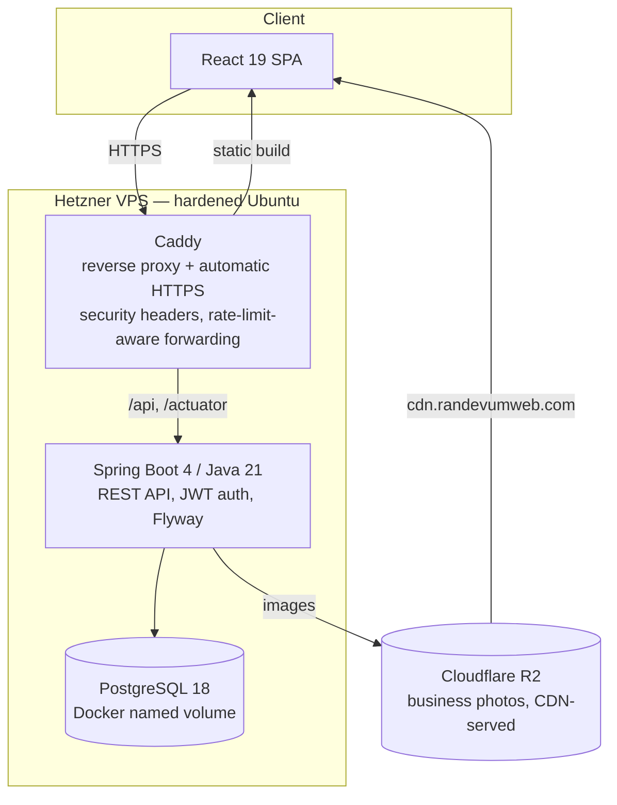

# Randevum

**A multi-tenant appointment booking platform for local service businesses** (hairdressers, salons, spas, tattoo studios) — built solo, end to end: backend, frontend, infrastructure, and security.

**This was deployed to a real, hardened production server** (`randevumweb.com`) — every claim below (security fixes, rate-limit proof, deploy hardening) was verified live against that deployment, not asserted from local development. [`RUNBOOK.md`](RUNBOOK.md) is the actual executed procedure with the live evidence gathered at each step. Current status ↓

[](https://github.com/abdullah-enes-ceylan/MyAppointment/actions/workflows/ci.yml)


---

## Project status

This went all the way to a real, hardened production deploy — not a decision to stop at `localhost`. Partway through, I made a deliberate call: local-business SaaS is a genuinely hard go-to-market problem (high-touch sales, low willingness to pay — a sales/distribution problem, not a technical one), and pursuing it commercially isn't the right use of time right now. The server was decommissioned the same day it was proven live, specifically to stop paying for infrastructure a paused side project doesn't need.

The engineering didn't stop because it got hard — it stopped because I made a scope call, the same way I would on a team. What's here is a complete, working, once-deployed system, not an abandoned one. [`NOTLAR.md`](NOTLAR.md) and [`ROADMAP.md`](ROADMAP.md) are the actual running decision log for this project — including the couple of known, deliberately deferred tradeoffs (documented with *why*, not just *what*), which I'd rather show than hide.

## What this actually is

A real SaaS product shape, not a CRUD tutorial: business owners register, manage their own tenant (services, staff, working hours, photo gallery), and customers discover, filter, and book appointments — with the whole thing deployed, secured, and once running live on a real server (see *Project status* above).

## Why this is worth a second look

- **Tenant isolation is structural, not a convention.** A business owner's `businessId` is never trusted from a request path or embedded in the JWT — every mutation re-derives ownership from the database (`OwnershipGuard`), and it's asserted twice for anything sensitive (once against the parent, once against the resource's *own* foreign key) to close IDOR gaps that a single check would miss.
- **N+1 queries are made impossible by the type system, not caught in review.** `Business` has no `@OneToMany` field for its photos or reviews on purpose — mapper methods take pre-batched data as parameters, so there's no code path where a list endpoint can *accidentally* fire one query per row.
- **Real security bugs were found and fixed on this exact codebase, not hypothetical.** A cross-tenant service-item takeover, an unauthenticated DoS via a zero-duration slot calculation, an IDOR on photo deletion — each is documented with how it was found, exploited to confirm it was real, and closed.
- **The deploy is a hardened Linux box, not `git push heroku`.** SSH key-only auth, `ufw`, `fail2ban`, unattended security upgrades, a non-root container user, staging-then-production ACME certificate rollout to avoid burning Let's Encrypt's rate limit, and a documented rollback procedure with image-tag pinning.
- **Rate limiting was proven, not assumed.** The client-IP-forwarding chain (Caddy → Spring's `forward-headers-strategy`) was verified by deliberately tripping the global rate limit from one machine while confirming a second, genuinely different IP was served normally at the same moment — not just "the code looks right."
- **Migrations are forward-only and expand-contract, on purpose.** Columns are never dropped in the same release that stops using them, because this project's own rollback story only reverts the *application*, not the schema — a lesson usually learned the hard way in production, applied here from the start.
- **GDPR-equivalent (KVKK) deletion is a real state machine**, not a stub: a grace period, business-specific appointment cancellation windows, and irreversible anonymization on a schedule — implemented and verified against a live database with real before/after row counts, not asserted.

None of this is decoration. It's what happens when "make it work" is followed by "now prove it, and prove it stays true under a real Linux kernel instead of Docker Desktop on Windows" — which is a distinction that mattered more than once during development (see [`RUNBOOK.md`](RUNBOOK.md) for two cases where Windows silently hid a bug that a real server exposed immediately).

## Architecture



Same-origin by design: the frontend build and API share one origin behind Caddy, so there's no CORS surface to misconfigure and no separate base-URL environment variable to keep in sync across environments.

## Tech stack

| Layer | Choices |
|---|---|
| **Backend** | Java 21, Spring Boot 4, Spring Security, Spring Data JPA / Hibernate, Flyway |
| **Database** | PostgreSQL 18 |
| **Frontend** | React 19, TypeScript, Vite, Tailwind CSS 4, React Router 7 |
| **Storage** | Cloudflare R2 (S3-compatible object storage) for business photos, served via a custom CDN domain |
| **Infra** | Docker Compose, Caddy (automatic HTTPS via Let's Encrypt), Hetzner Cloud (Ubuntu) |
| **Testing** | JUnit 5, Mockito, Testcontainers (real PostgreSQL in CI, not H2) |
| **CI** | GitHub Actions — backend test suite, frontend typecheck/lint/build, Docker build verification, all required to merge |

## Feature highlights

- **Multi-tenant business management** — one owner account can manage multiple businesses; every one of them gets its own services, staff, working hours, closures, and photo gallery.
- **Real availability algorithm**, not a static calendar — computes open slots from working hours, existing appointments, staff assignment, and a configurable minimum lead time, all against a single injected `Clock` (no naked `LocalDateTime.now()` anywhere in the codebase — every time-dependent test uses a fixed clock instead of sleeping or racing the wall clock).
- **Appointment lifecycle as a real state machine** — `PENDING → APPROVED/REJECTED`, auto-expiry for unanswered requests, `NO_SHOW` marking, and an opt-in "auto-approve" mode per business.
- **Reviews gated by actual attendance** — only a customer who genuinely completed that specific appointment can leave a rating.
- **Multi-photo gallery** (up to 5 per business) with drag-free reordering-by-upload-order, R2-backed storage, and a swipeable customer-facing carousel.
- **Location-aware discovery** — bounding-box + Haversine "near me" search, category and served-gender filtering.
- **Account deletion / KVKK compliance** — self-service deletion with a grace period, automatic appointment cancellation for business owners, and scheduled irreversible anonymization.

## Security posture

- JWT authentication, BCrypt password hashing, role-based authorization (`USER` / `BUSINESS_OWNER` / `ADMIN`).
- Every mutating endpoint re-validates ownership server-side; nothing trusts a client-supplied ID.
- IP-based rate limiting (global + per-sensitive-endpoint) reading the real client IP through the reverse proxy, not the container's internal bridge address.
- Uploaded images are validated by decoding their actual bytes (`ImageIO`), never by trusting the client's declared content-type or file extension — a `.jpg`-named SVG with an embedded `<script>` is rejected the same way a genuine SVG is, because the check never looks at the name.
- Every uploaded image is fully re-encoded server-side (not just format-checked), which incidentally strips EXIF/GPS metadata as a side effect of how the defense works, not as a separate feature.
- Structured JSON logging with PII masking on the few call sites where a third-party exception message could otherwise leak an email address into the logs.

## Testing

166 automated tests across 28 test classes — unit tests for the pure logic (slot calculation, expiry policy, rate limiting) and integration tests against a real, ephemeral PostgreSQL instance via Testcontainers, because an H2-backed test suite would happily pass while hiding a real Postgres-specific bug.

```bash
cd backend && ./mvnw test
```

## Running it locally

```bash
# Backend (needs a local PostgreSQL — see backend/src/main/resources/application-dev.properties.example)
cd backend && ./mvnw spring-boot:run

# Frontend
cd frontend && npm install && npm run dev
```

Or the full stack, containerized, the same way it runs in production:

```bash
cp .env.example .env   # fill in the placeholders
docker compose up -d --build
```

## Project structure

```
backend/    Spring Boot API — layered (entity / repository / service / controller),
            17 Flyway migrations, 28 test classes
frontend/   React SPA — pages, reusable components, a single typed API client
RUNBOOK.md  The actual, executed step-by-step production deployment procedure —
            every command paired with the exact evidence it should produce
```

## What's next

- Automated email notifications (the current `NotificationPort` abstraction already supports swapping in a real channel without touching call sites)
- Backup + restore drill (Phase 3.8b — deliberately sequenced *after* proving the initial deploy stable for 48 hours, not before)
- A super-admin panel for platform-level moderation

## License

MIT — see [LICENSE](LICENSE).
